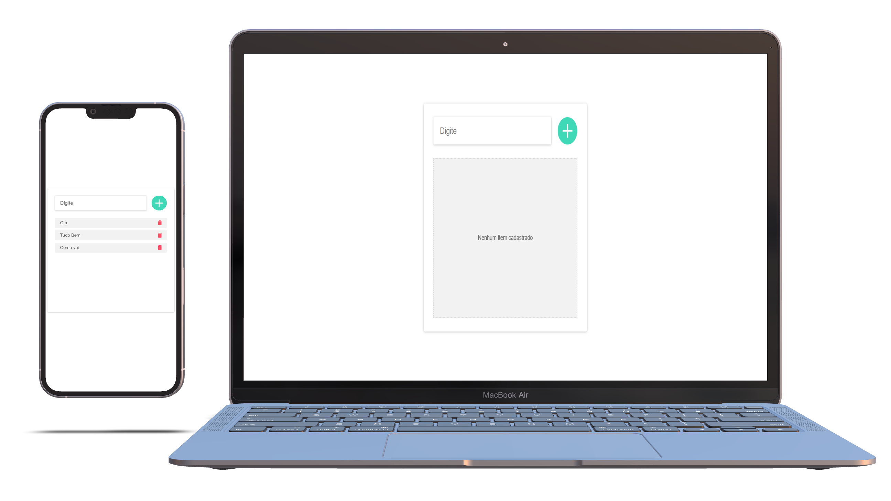

# todo-app-react

<h4 align="center">
    :computer: App TODO List
</h4>

    <a href="#-projeto">Projeto</a>&nbsp;&nbsp;&nbsp;|&nbsp;&nbsp;&nbsp;
    <a href="#rocket-tecnologias">Tecnologias</a>&nbsp;&nbsp;&nbsp;|&nbsp;&nbsp;&nbsp;
    <a href="#user-content-clipboard-instruções">Instruções</a>&nbsp;&nbsp;&nbsp;|&nbsp;&nbsp;&nbsp;
    <a href="#-ajustes-e-melhorias">Melhorias</a>

 

## 💻 Projeto

Frontend App em ReactJS. App frontend TODO List para adição e remoção de itens em uma lista.

 

## :rocket: Tecnologias

- [ReactJS](https://pt-br.reactjs.org/)
- [Vite](https://vitejs.dev/)
- [Typescript](https://www.typescriptlang.org/)
- [HTML5](https://developer.mozilla.org/pt-BR/docs/Web/Guide/HTML/HTML5)
- [CSS3](https://developer.mozilla.org/pt-BR/docs/Web/CSS)
- [styled-components](https://styled-components.com/)

---

## :clipboard: Instruções

### INTERFACE - FRONTEND

- Execute `$ yarn` para instalar todas as dependencias.
- Após todas as dependencias serem instaladas, basta executar `yarn dev` para iniciar a interface frontend. A aplaicação estará disponível em `http://localhost:3000/`

---

## 📌 Ajustes e melhorias

Até o momento nenhuma nova feature para o projeto
